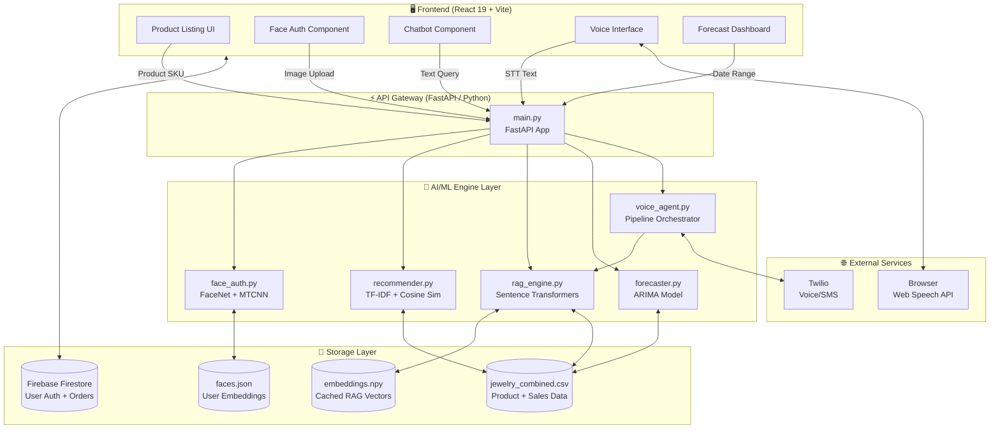
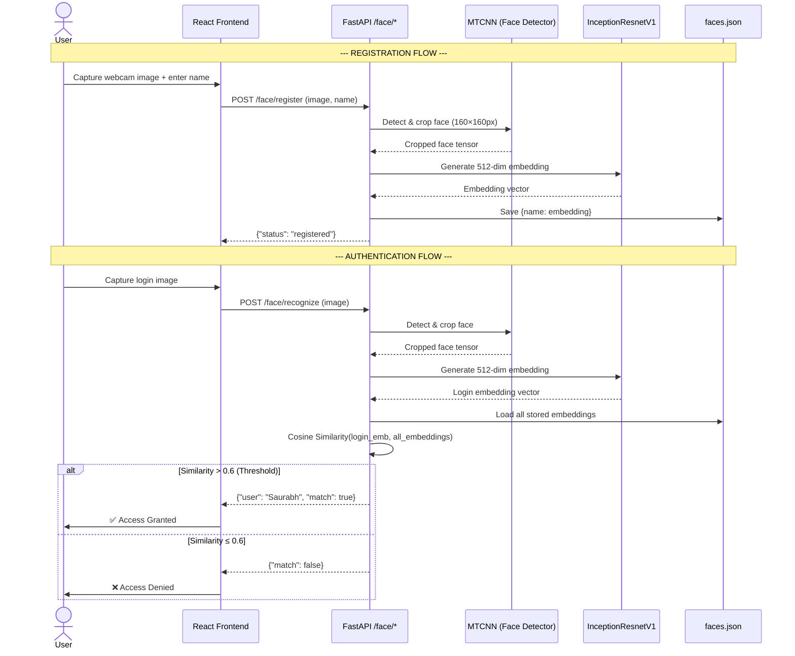
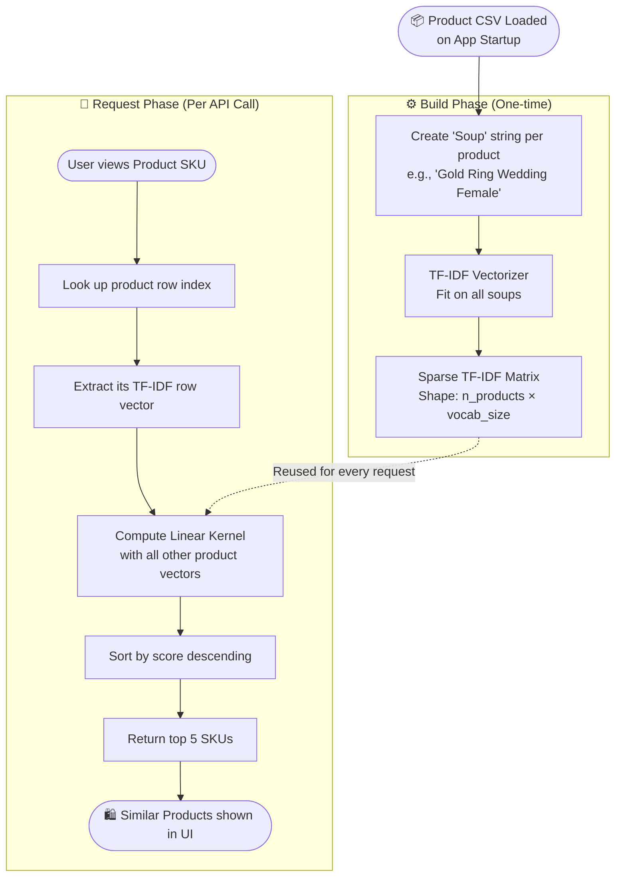
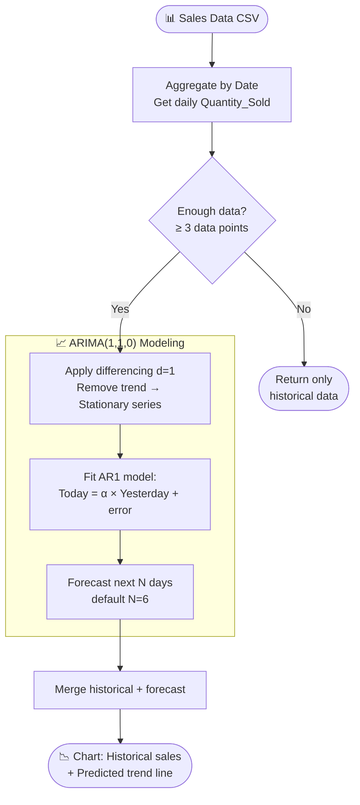
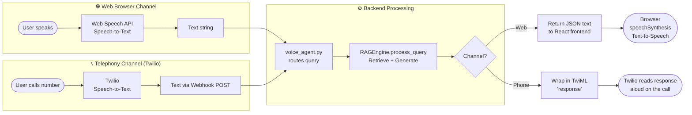
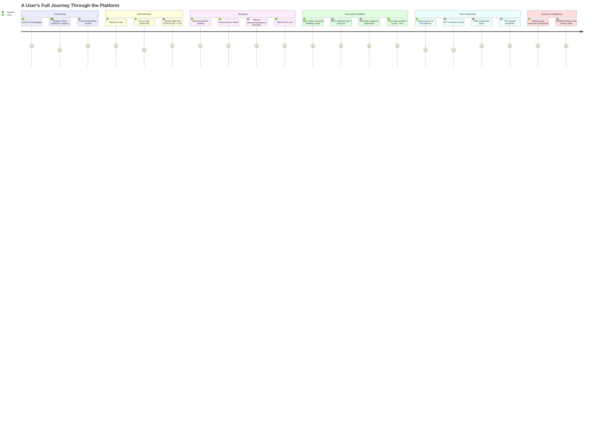

# AI Jewelry Recommendation & Forecasting System
## Architecture & Workflow Diagrams

> **Purpose**: This document provides a visual and structured breakdown of the entire system—its high-level architecture, individual model workflows, and data flows. It is designed to complement `INTERVIEW_GUIDE.md` and `PROJECT_MODELS.md` for technical interview preparation.

---

## 1. High-Level System Architecture



---

## 2. Face Authentication Workflow



---

## 3. Recommendation Engine Workflow



---

## 4. RAG Chatbot Workflow

```mermaid
flowchart LR
    subgraph INDEXING["📚 Indexing (Startup)"]
        A[Load all products from CSV] --> B
        B[Build rich description per product:\nName + Material + Category + Occasion] --> C
        C[SentenceTransformer\nall-MiniLM-L6-v2\nEncode all descriptions] --> D
        D[(embeddings.npy\nCached 384-dim vectors)]
    end

    subgraph RETRIEVAL["🔍 Retrieval (Per Query)"]
        E([User types/speaks query]) --> F
        F[SentenceTransformer\nEncode query → vector] --> G
        G[Cosine Similarity\nvs all cached embeddings] --> H
        H[Top 4 most relevant\nproducts retrieved]
    end

    subgraph GENERATION["✍️ Generation (Template Engine)"]
        H --> I{Analyze metadata\nof retrieved products}
        I --> J[Check price range,\nmaterials, occasions]
        J --> K[Fill Logic Template:\n'I found {Name} crafted\nfrom {Material}...']
        K --> L{Occasion detected?}
        L -->|Wedding| M[Append: 'Perfect for your\nspecial day!']
        L -->|No special| N[Append: 'Here are\nyour top picks!']
        M & N --> O([📩 Natural language\nresponse + product cards])
    end

    D -.->|Loaded once| G
```

---

## 5. Demand Forecasting Workflow



---

## 6. Voice Agent Pipeline



---

## 7. Full User Journey (End-to-End)



---

## 8. Technology Stack Summary

| Layer | Technology | Why Chosen |
|---|---|---|
| **Frontend** | React 19 + Vite | Component-based UI, fast HMR dev experience |
| **Backend** | FastAPI (Python) | Async, auto-validation (Pydantic), Swagger docs |
| **Face Detection** | MTCNN | Fast, accurate multi-stage face cropping |
| **Face Embedding** | InceptionResnetV1 (VGGFace2) | 99.6% LFW accuracy, 512-dim robust embeddings |
| **Recommendation** | TF-IDF + Cosine Similarity | No training data needed, solves Cold Start |
| **Semantic Search** | `all-MiniLM-L6-v2` | 6× faster than BERT, 384-dim, offline |
| **Forecasting** | ARIMA(1,1,0) | Interpretable, lightweight for small datasets |
| **Voice (Web)** | Web Speech API | Zero-latency, browser-native, no API cost |
| **Voice (Phone)** | Twilio + TwiML | Production-grade telephony integration |
| **Auth / DB** | Firebase Firestore | Scalable NoSQL, real-time, built-in auth |
| **Deployment** | Hugging Face Spaces + Vercel | Free-tier friendly, Docker support |

---

## 9. Key Design Decisions (Interview Talking Points)

### ❓ Why no OpenAI/ChatGPT?
> **Answer**: Cost, latency, and privacy. Using local `sentence-transformers` gives **zero API cost**, **<50ms retrieval**, and **no data leaves the server**. The Template Engine replaces hallucination-prone LLMs with deterministic, verifiable output.

### ❓ Why Content-Based over Collaborative Filtering?
> **Answer**: Collaborative Filtering requires a large history of user-item interactions. A new product or new user gets no recommendations (**Cold Start Problem**). Content-Based works from day one using only product metadata.

### ❓ How would you scale this?
> **Answer**: Replace the in-memory NumPy cosine search with **FAISS** or **Pinecone** (vector DB) for O(log n) retrieval. Replace ARIMA with **Prophet** or **LSTM** for non-linear trend capture. Add a Redis cache for hot product embeddings.

### ❓ What is the threshold of 0.6 in Face Auth?
> **Answer**: It was empirically tuned. Below 0.6 = too many False Accepts (security risk). Above ~0.7 = too many False Rejects (bad UX, especially with lighting changes). 0.6 balances FAR vs FRR for a demo environment.
